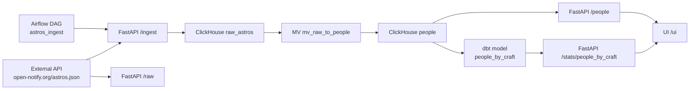

# Astros ClickHouse Pipeline

A complete, containerized data pipeline that:
- fetches raw JSON data from `http://api.open-notify.org/astros.json`
- stores raw data in ClickHouse
- parses JSON via a materialized view
- builds analytics tables with dbt
- provides FastAPI endpoints + a simple UI
- schedules ingestion with Airflow

This repository is designed to be **production?shaped** (clear separation of concerns, reproducible environment, deterministic ingestion, and explicit data flow).

---

## Architecture

### Data Flow



---

## Repository Layout

```
C:\Users\ichel\OneDrive\Documents\Playground
?? docker-compose.yml
?? requirements.txt
?? requirements-dev.txt
?? pyproject.toml
?? README.md
?? .gitignore
?? app/
?  ?? __init__.py
?  ?? ch_client.py
?  ?? ingest.py
?? clickhouse/
?  ?? init.sql
?? fastapi/
?  ?? Dockerfile
?  ?? main.py
?? airflow/
?  ?? Dockerfile
?  ?? requirements.txt
?  ?? dags/
?     ?? astros_ingest.py
?? dbt/
?  ?? Dockerfile
?  ?? dbt_project.yml
?  ?? profiles.yml
?  ?? models/
?     ?? people_by_craft.sql
?? tests/
?  ?? test_ingest.py
?? docs/
   ?? README.md
```

---

## Services

### ClickHouse
- **Role:** data warehouse and parser
- **Tables:**
  - `raw_astros` (raw JSON)
  - `people` (parsed rows)
  - `people_by_craft` (dbt model)
- **Materialized View:** `mv_raw_to_people`
- **Dedup:** `ReplacingMergeTree` + `OPTIMIZE FINAL`

### FastAPI
- **Role:** ingestion trigger + read API + minimal UI
- **Key endpoints:**
  - `GET /health` ? health check
  - `GET /raw` ? fetch raw JSON (no insert)
  - `POST /ingest` ? fetch + insert
  - `GET /people` ? read parsed data
  - `GET /stats/people_by_craft` ? read analytics model
  - `GET /ui` ? simple dashboard

### Airflow
- **Role:** scheduled ingestion
- **DAG:** `astros_ingest`
- **Schedule:** hourly
- **Parallelism:** set to 4 by config

### dbt
- **Role:** transformation layer for analytics
- **Model:** `people_by_craft`

---

## Setup & Run

### Start all services

```bash
docker compose up -d --build
```

### Check service status

```bash
docker compose ps -a
```

---

## Using the API

### Health check

```bash
curl http://localhost:8000/health
```

### Fetch raw JSON (no insert)

```bash
curl http://localhost:8000/raw
```

### Ingest data

```bash
curl -X POST http://localhost:8000/ingest
```

### Read parsed data

```bash
curl http://localhost:8000/people?limit=10
```

### Read analytics model

```bash
curl http://localhost:8000/stats/people_by_craft
```

### UI

Open in browser:
```
http://localhost:8000/ui
```

---

## Using Airflow

1. Open UI: `http://localhost:8080`
2. Login:
   - If using `airflow standalone`, check logs:
     ```bash
     docker compose logs airflow --tail 200
     ```
   - Look for `Username:` and `Password:`
3. Enable DAG `astros_ingest`
4. Trigger manually or wait for schedule

---

## Using ClickHouse

### Verify raw data
```bash
docker compose exec -T clickhouse clickhouse-client --query "SELECT count() FROM raw_astros"
```

### Verify parsed data
```bash
docker compose exec -T clickhouse clickhouse-client --query "SELECT count() FROM people"
```

### Check analytics
```bash
docker compose exec -T clickhouse clickhouse-client --query "SELECT * FROM people_by_craft ORDER BY craft"
```

---

## Using dbt

### Run models
```bash
docker compose run --rm dbt run
```

### Debug connection
```bash
docker compose run --rm dbt debug
```

---

## Tests

### Local
```bash
pip install -r requirements.txt -r requirements-dev.txt
pytest
```

### In Docker
```bash
docker compose run --rm fastapi pytest
```

---

## Documentation (from docstrings)

We use `pdoc` to build HTML docs from Python docstrings.

### Build docs locally
```bash
pdoc app -o docs
```

Docstrings were added to:
- `app/ch_client.py`
- `app/ingest.py`

---

## Linters

We use:
- `ruff` for linting
- `black` for formatting

Run locally:
```bash
ruff check .
black --check .
```

---

## Configuration

### Environment variables (by service)

**FastAPI**
- `CLICKHOUSE_HOST`
- `CLICKHOUSE_PORT`
- `CLICKHOUSE_DATABASE`
- `CLICKHOUSE_USER`
- `CLICKHOUSE_PASSWORD`
- `ASTROS_URL`
- `RUN_OPTIMIZE`

**Airflow**
- `AIRFLOW__CORE__EXECUTOR`
- `AIRFLOW__CORE__MAX_ACTIVE_RUNS_PER_DAG`
- `AIRFLOW__CORE__MAX_ACTIVE_TASKS_PER_DAG`
- `AIRFLOW__CORE__PARALLELISM`
- plus ClickHouse envs above

**dbt**
- `DBT_PROFILES_DIR`
- plus ClickHouse envs above

---

## Data Model

### raw_astros
```
id UInt64
raw_json String
_inserted_at DateTime
```

### people
```
craft String
name String
_inserted_at DateTime
```

### people_by_craft
```
craft String
people_count UInt64
last_seen_at DateTime
```

---

## Deduplication Behavior

- `raw_astros` uses a deterministic `id` (hash of JSON)
- `people` uses `ReplacingMergeTree` with `(craft, name)` key
- Running `OPTIMIZE TABLE people FINAL` keeps only the latest row per `(craft, name)`

---

## Production Checklist

**Security**
- Store secrets in `.env` or secret manager (not in compose)
- Disable unauthenticated access to FastAPI and ClickHouse
- Use TLS if exposing services publicly

**Reliability**
- Pin Docker image versions (avoid `latest`)
- Add healthchecks for FastAPI and Airflow
- Enable Airflow retries and timeouts

**Data Quality**
- Add dbt tests (e.g., non?null `name`, `craft`)
- Monitor ingestion failures
- Track row counts/changes per run

**Observability**
- Centralize logs (ELK/Loki)
- Add basic metrics for ingestion duration
- Alert on repeated DAG failures

**Scaling**
- Move Airflow metadata DB from SQLite to Postgres
- Use ClickHouse cluster if data grows
- Separate scheduler/triggerer/workers for Airflow

---

## CI/CD

Two workflows are included:
- `CI` runs on every push/PR
- `Nightly` runs every day at 02:00 UTC

Both run:
1. `docker compose up -d --build`
2. `pytest`
3. `ruff + black`
4. `pdoc` docs build
5. `dbt run`

---

## Common Troubleshooting

### Airflow DAG fails
Check task logs:
```bash
docker compose exec -T airflow airflow tasks test astros_ingest fetch_and_insert 2026-03-12T16:00:00+00:00
```

### ClickHouse init fails
If init.sql fails, tables will not exist. Recreate:
```bash
docker compose exec -T clickhouse clickhouse-client --user app --password app --query "CREATE TABLE IF NOT EXISTS raw_astros (id UInt64, raw_json String, _inserted_at DateTime) ENGINE = ReplacingMergeTree(_inserted_at) ORDER BY id;"
```

---

## Future Extensions

- Kafka pipeline (Kafka engine in ClickHouse)
- BI dashboards (Grafana/Metabase)
- Auth on FastAPI

---

## Credits

- ClickHouse
- FastAPI
- Apache Airflow
- dbt
